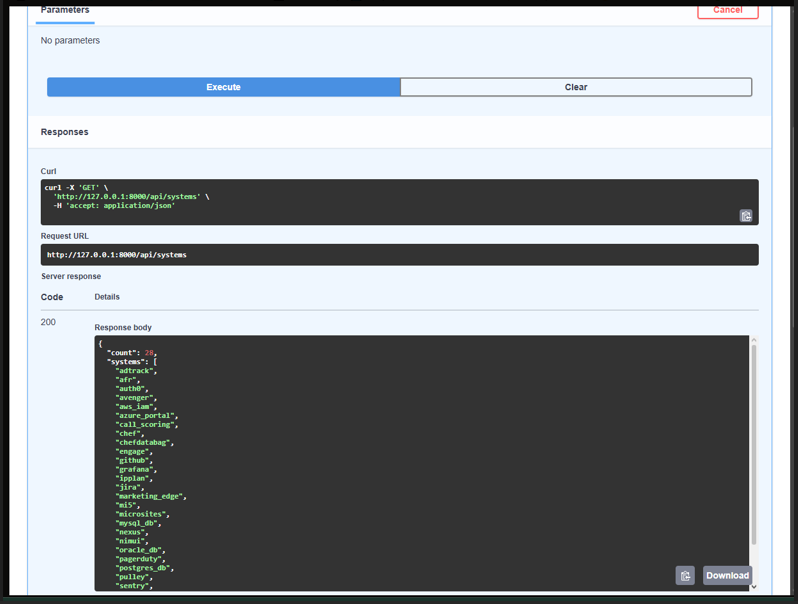
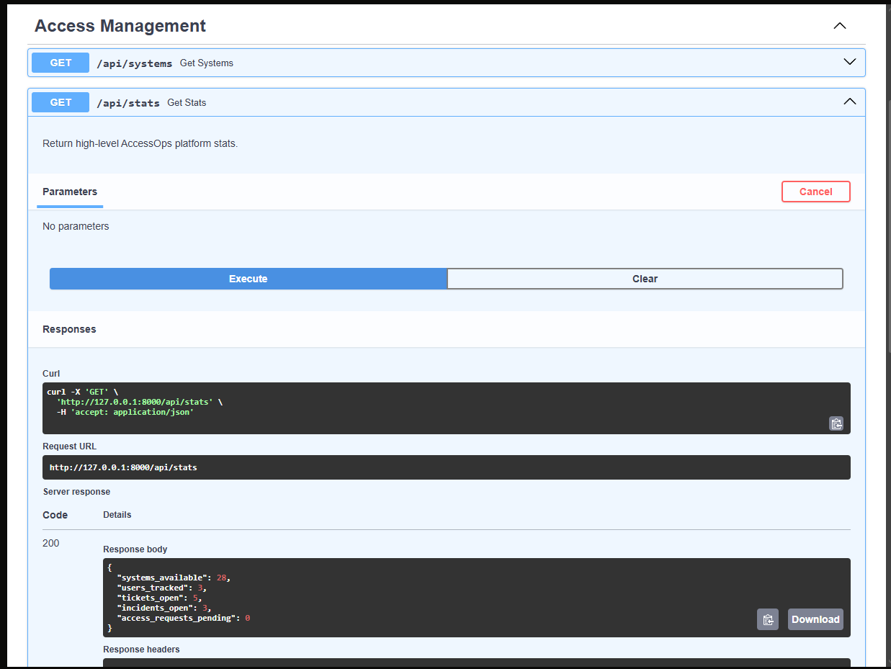
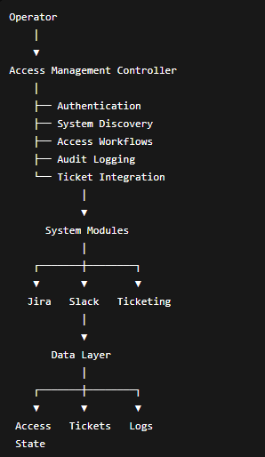

# AccessOps Toolkit


A Python-based Identity and Access Management (IAM) automation platform that simulates real-world onboarding, offboarding, access auditing, entitlement reviews, and access remediation workflows.

AccessOps Toolkit demonstrates how operational teams can centrally manage user access across multiple systems while maintaining auditability, workflow validation, and operational consistency.

Originally inspired by internal operational tooling concepts, this version has been rebuilt as a portfolio-safe standalone application suitable for public GitHub hosting and technical review.

---

# Features

✅ FastAPI REST API

✅ Swagger / OpenAPI Documentation

✅ Rich CLI Interface

✅ Tkinter GUI

✅ Dynamic System Discovery

✅ Access Auditing

✅ Access Provisioning

✅ Access Removal

✅ Ticket Ownership Validation

✅ Platform Metrics Endpoint

✅ Modular System Connectors

✅ Architecture Documentation

---

# Technologies Used

### Languages & Frameworks

- Python 3.11
- FastAPI
- Tkinter

### Development Tools

- Git
- GitHub
- Swagger / OpenAPI
- argparse
- pathlib
- logging
- JSON

### Concepts Demonstrated

- Identity & Access Management (IAM)
- Operational Automation
- API Development
- Workflow Automation
- Modular Architecture
- Audit Logging
- Access Reviews
- Access Provisioning
- Entitlement Management
- Platform Metrics

---

# REST API

Start the API locally:

```bash
uvicorn api.main:app --reload
```

Swagger UI:

```text
http://127.0.0.1:8000/docs
```

---

## API Endpoints

### System Discovery

```http
GET /api/systems
```

Returns all available access-managed systems.

---

### Platform Statistics

```http
GET /api/stats
```

Returns high-level platform metrics.

Example:

```json
{
  "systems_available": 28,
  "users_tracked": 3,
  "tickets_open": 5,
  "incidents_open": 3,
  "access_requests_pending": 0
}
```

---

### User Access Audit

```http
GET /api/users/{username}/access
```

Optional query parameter:

```http
?system=jira
```

Returns discovered access for a user.

---

### Grant Access

```http
POST /api/users/{username}/grant/{system}
```

Example:

```http
POST /api/users/janesmith/grant/jira
```

---

### Remove Access

```http
POST /api/users/{username}/remove/{system}
```

Example:

```http
POST /api/users/janesmith/remove/ticketing
```

---

# Swagger Documentation

## API Overview


---

## Systems Endpoint



---

## Platform Statistics Endpoint



---

## User Access Audit Endpoint


---

# CLI Usage

## List Available Systems

```bash
python access_management.py --list-systems
```

---

## Audit User Access

```bash
python access_management.py check kboller
```

---

## Grant Access

```bash
python access_management.py grant janesmith --system jira --mock
```

---

## Remove Access

```bash
python access_management.py remove janesmith --system ticketing --dry-run
```

---

# CLI Screenshots

## Dynamic System Discovery


---

## Access Audit


---

## Grant Access


---

## Dry Run Removal


---

# Architecture



## High-Level Flow

```text
Operator
    │
    ▼
Access Management Controller
    │
    ├── Authentication
    ├── System Discovery
    ├── Access Auditing
    ├── Provisioning
    ├── Deprovisioning
    ├── Ticket Validation
    └── Audit Logging
            │
            ▼
      System Connectors
            │
            ▼
          Data Layer
```

Additional documentation:

- docs/architecture.md
- docs/workflow_examples.md
- docs/credentials.md

---

# Project Structure

```text
accessops-toolkit/
│
├── access_management.py
├── soctool.py
│
├── api/
│   ├── main.py
│   └── routes/
│       └── access.py
│
├── config/
├── data/
├── docs/
├── logs/
├── reports/
├── systems/
├── tests/
├── tools/
└── utils/
```

---

# Example Workflows

## Access Review

```bash
python access_management.py check kboller
```

Workflow:

1. Discover available systems
2. Execute access checks
3. Aggregate results
4. Generate audit output

API Equivalent:

```http
GET /api/users/kboller/access
```

---

## New Hire Provisioning

```bash
python access_management.py grant janesmith --system jira --mock
```

Workflow:

1. Validate target system
2. Execute provisioning workflow
3. Record audit event
4. Return confirmation

API Equivalent:

```http
POST /api/users/janesmith/grant/jira
```

---

## Employee Separation

```bash
python access_management.py remove janesmith --system ticketing --dry-run
```

Workflow:

1. Verify ownership
2. Review tickets
3. Reassign operational assets
4. Remove access
5. Record audit history

API Equivalent:

```http
POST /api/users/janesmith/remove/ticketing
```

---

# Configuration

Configuration values are loaded from:

```text
config/creds.json
```

Example:

```json
{
  "LDAP_HOST": "ldap.example.com",
  "LDAP_BASE_DN": "dc=example,dc=com",
  "POSTGRES_HOST": "localhost",
  "POSTGRES_PORT": 5432
}
```

Sensitive values are intentionally excluded from source control.

---

# Safety

This repository intentionally contains:

- No proprietary source code
- No production credentials
- No customer information
- No internal infrastructure
- No real authentication systems

All integrations are mocked, generalized, or sanitized for portfolio use.

---

# Roadmap

## Version 2.x

- Access history tracking
- Role templates
- User lifecycle management
- Enhanced reporting
- SQLite persistence layer

## Version 3.x

- Authentication layer
- Expanded REST API
- Connector abstraction improvements
- Approval workflows

## Future

- JWT Authentication
- Role Based Access Control
- PostgreSQL Support
- Audit History Dashboard
- Approval Workflows

---

# Why This Project Exists

AccessOps Toolkit demonstrates the type of automation platforms commonly used by:

- Security Operations (SOC)
- IT Operations
- IAM Teams
- Platform Engineering
- DevOps Organizations

Typical use cases include:

- Employee onboarding
- Employee offboarding
- Access reviews
- Entitlement verification
- Audit preparation
- Access remediation

while remaining fully safe for public GitHub hosting, technical interviews, and portfolio review.

# Author

**Kenneth Lloyd Boller**

Python Backend Developer | AI Automation | FastAPI | RAG Systems | SOC Automation

GitHub:
https://github.com/Fll0yd